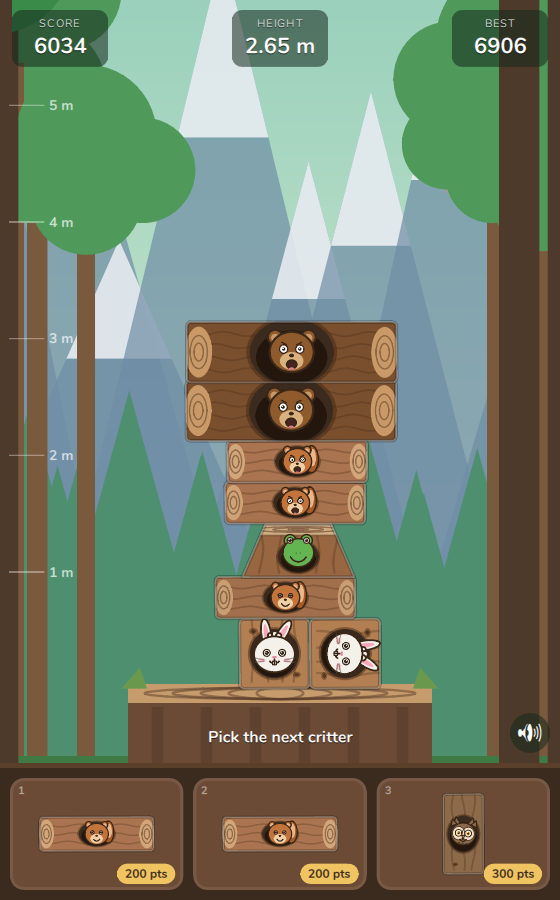

# Critters

A Rust port of **Critter Stack**, a physics stacking game: build the
tallest tower of forest critters you can without anyone falling off the
stump. Rebuilt on [agg-gui](https://github.com/larsbrubaker/agg-gui) with
[box2d-rust](https://github.com/larsbrubaker/box2d-rust) physics, running
native (Windows/macOS/Linux) and in the browser via WebAssembly.

**Play it:** https://larsbrubaker.github.io/Critters/

[](https://larsbrubaker.github.io/Critters/)

## How to play

- Tap anywhere to dismiss the intro card, then tap or click a critter in
  the tray to pick it up. Its slot stays empty until you drop, then refills.
- The held critter follows your pointer. Move it over the tower, then tap
  or release to drop it, or drag straight up from the tray onto the stage
  and let go. Picking another slot while holding swaps them.
- You can only drop once every piece on the tower has come to rest.
- Scroll down to admire the tower with the mouse wheel, a vertical drag on
  the play area, or `↓` / `↑`.
- Keyboard: `1` / `2` / `3` pick a slot, `←` `→` move, `Space` drop or
  restart.
- The round ends when a piece slips below the stump top, goes over the
  side, or a rested piece tumbles more than 1.5 m down the tower.

Every shape has a fixed resident critter; harder shapes carry more points,
multiplied by how high the piece sits (100 px = 1 m). The altitude tiers,
wind gusts, idle animations, expressions and synthesized sounds are all
the original's — see `reference/README.md`.

## Building

Requires the [agg-gui](https://github.com/larsbrubaker/agg-gui) and
[box2d-rust](https://github.com/larsbrubaker/box2d-rust) repos checked out
as sibling directories (`../agg-gui`, `../box2d-rust`).

```powershell
cargo run --release -p critters-native   # desktop
cargo test --workspace                   # tests
```

Web build:

```powershell
wasm-pack build critters-wasm --target web --out-dir ../demo/public/pkg --no-typescript
cd demo; bun install; bun run dev
```

`CRITTERS_SCREENSHOT=shot.png cargo run --release -p critters-native`
captures a frame and exits.

## Layout

- `critters-core` — game, rendering, audio synthesis (target-agnostic)
- `critters-native` — winit + wgpu shell, cpal audio, settings file
- `critters-wasm` — browser shell, Web Audio, `localStorage`
- `demo` — Vite bundle deployed to GitHub Pages
- `reference` — the JavaScript original (read-only ground truth)

## License

MIT. Bundled fonts: Nunito and Liberation Sans (SIL OFL), Noto Emoji
(SIL OFL), Font Awesome Free (SIL OFL).
